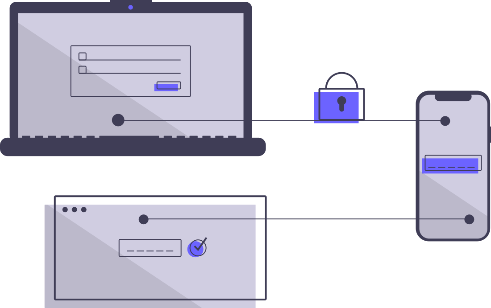
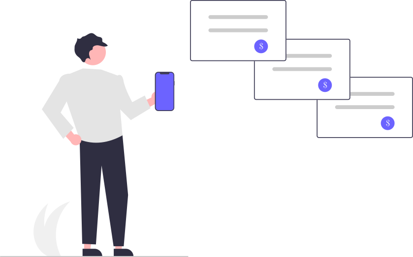

# Gestor de Tareas

Aplicacion multiplataforma desarrollada en Flutter para administrar tareas personales con autenticacion, calendario, categorias, prioridades, seguimiento de progreso y exportacion de reportes en PDF. El proyecto se conecta a un backend en Node.js/Express con MongoDB para manejar usuarios, sesiones y persistencia de tareas.

## Autor

**Luis Bautista**

Proyecto academico desarrollado para la asignatura de Topicos avanzados de software.

## Vista General

El Gestor de Tareas permite que cada usuario cree una cuenta, inicie sesion y administre sus tareas de forma privada. La app incluye una experiencia visual moderna con ilustraciones SVG, animaciones, efectos de particulas, sonidos de confirmacion y una pantalla de progreso para revisar el avance por categoria.

## Imagenes de la App

| Login | Registro | Recuperacion |
|---|---|---|
|  |  |  |

Recursos visuales incluidos:

- `gestor_tareas_app/lib/assets/images/login.svg`
- `gestor_tareas_app/lib/assets/images/signup.svg`
- `gestor_tareas_app/lib/assets/images/forgot_password.svg`
- `gestor_tareas_app/lib/assets/images/bg.png`
- `gestor_tareas_app/lib/assets/images/to_do.avif`

## Funcionalidades Principales

- Registro de usuarios con nombre, correo, contrasena, pregunta secreta y respuesta secreta.
- Inicio y cierre de sesion con token JWT.
- Persistencia local del token mediante `shared_preferences`.
- Recuperacion de contrasena por enlace enviado al correo.
- Recuperacion alternativa mediante pregunta/respuesta secreta.
- Creacion, lectura, actualizacion y eliminacion de tareas.
- Tareas con titulo, descripcion, categoria, prioridad, fecha de inicio, fecha de fin y recordatorio.
- Marcado de tareas como completadas o pendientes.
- Vista de calendario con tareas agrupadas por fecha.
- Vista general de todas las tareas.
- Filtros por categoria y ordenamiento por fecha.
- Sonidos al completar o desmarcar tareas.
- Pantalla de progreso con indicadores por categoria.
- Exportacion de reporte de progreso en PDF.
- Interfaz con animaciones, particulas flotantes y componentes Material Design.

## Sesiones y Seguridad

La autenticacion se maneja desde el backend con JSON Web Tokens.

Flujo principal:

1. El usuario se registra o inicia sesion.
2. El backend valida las credenciales y devuelve un token JWT.
3. La app guarda el token localmente con `shared_preferences`.
4. Cada peticion protegida envia el token en el encabezado `Authorization: Bearer <token>`.
5. El backend valida el token antes de permitir operaciones sobre tareas.
6. Al cerrar sesion, la app elimina el token local.

Medidas implementadas:

- Contrasenas cifradas con `bcryptjs`.
- Respuestas secretas cifradas antes de guardarse.
- Tokens JWT con expiracion.
- Middleware de autenticacion para proteger las rutas de tareas.
- Recuperacion de contrasena con token temporal.

## Modulos de la App

- **Login:** acceso de usuarios registrados.
- **Registro:** creacion de cuenta con validaciones y pregunta secreta.
- **Recuperacion de contrasena:** restablecimiento por correo o respuesta secreta.
- **Gestion de tareas:** CRUD completo de tareas.
- **Calendario:** visualizacion por fecha usando `table_calendar`.
- **Progreso:** resumen de tareas completadas y pendientes.
- **Exportacion PDF:** generacion de reportes con `pdf` y `printing`.

## Tecnologias Utilizadas

Frontend:

- Flutter
- Dart
- Material Design
- HTTP Client
- Shared Preferences
- Table Calendar
- Google Fonts
- Flutter SVG
- Audioplayers
- Flutter Animate
- Confetti
- FL Chart
- PDF y Printing

Backend:

- Node.js
- Express
- MongoDB
- Mongoose
- JSON Web Token
- BcryptJS
- Dotenv
- CORS
- Nodemailer
- Mailtrap para pruebas de correo

Herramientas:

- Visual Studio Code
- Git y GitHub
- Docker / Docker Compose
- MongoDB local o contenedor Docker
- Flutter SDK
- Node.js y npm

## Estructura del Proyecto

```text
To Do App - Gestor de tareas/
+-- README.md                   # README visible en GitHub
+-- gestor_tareas_app/          # Aplicacion Flutter
|   +-- lib/
|   |   +-- main.dart
|   |   +-- screen/
|   |   +-- services/
|   |   +-- assets/images/
|   +-- assets/sounds/
|   +-- pubspec.yaml
|
+-- gestor-tareas-backend/      # API REST
    +-- controller/
    +-- middlewares/
    +-- models/
    +-- routes/
    +-- server.js
    +-- package.json
    +-- docker-compose.yml
```

## Instalacion y Ejecucion

### 1. Backend

Desde la carpeta del backend:

```bash
cd gestor-tareas-backend
npm install
node server.js
```

El frontend esta configurado para consumir:

```text
http://localhost:5000/api
```

Variables de entorno esperadas en `gestor-tareas-backend/.env`:

```env
PORT=5000
MONGO_URI=tu_uri_de_mongodb
JWT_SECRET=tu_clave_secreta
MAILTRAP_USER=tu_usuario_mailtrap
MAILTRAP_PASS=tu_password_mailtrap
```

Puedes tomar como base:

```text
gestor-tareas-backend/.env.example
```

### 2. Frontend

Desde la carpeta de Flutter:

```bash
cd gestor_tareas_app
flutter pub get
flutter run
```

Para ejecutar en navegador:

```bash
flutter run -d chrome
```

## Endpoints Principales

Autenticacion:

- `POST /api/auth/register`
- `POST /api/auth/login`
- `POST /api/auth/check-user`
- `POST /api/auth/forgot-password`
- `POST /api/auth/reset-password/:token`
- `POST /api/auth/secret-recovery`

Tareas:

- `GET /api/tasks`
- `POST /api/tasks`
- `PUT /api/tasks/:id`
- `DELETE /api/tasks/:id`

## Modelo de Datos

Usuario:

- `username`
- `email`
- `password`
- `secretQuestion`
- `secretAnswer`
- `resetToken`
- `resetTokenExp`

Tarea:

- `title`
- `description`
- `completed`
- `category`
- `prioridad`
- `startDate`
- `endDate`
- `reminder`
- `userId`
- `createdAt`

## Reportes

La pantalla de progreso muestra:

- Total de tareas completadas.
- Total de tareas pendientes.
- Porcentaje de avance.
- Progreso por categoria.
- Filtros por categoria y fecha.
- Exportacion del resumen en PDF.

## Estado del Proyecto

El proyecto cuenta con frontend Flutter, backend Express y conexion a MongoDB. La aplicacion esta pensada para ejecutarse en entorno local durante desarrollo, con posibilidad de adaptarse a despliegue cambiando la URL base de la API y las variables de entorno del backend.

## Creditos

Desarrollado por **Luis Bautista**.

Tecnologias principales: Flutter, Dart, Node.js, Express y MongoDB.
